# AI Environments

A comprehensive guide to understanding different types of environments in artificial intelligence systems and their characteristics.

## Table of Contents

- [What are AI Environments?](#what-are-ai-environments)
- [Environment Characteristics](#environment-characteristics)
- [Environment Classification](#environment-classification)
- [Real-World Examples](#real-world-examples)
- [Environment Design Considerations](#environment-design-considerations)
- [Simulation vs Real Environments](#simulation-vs-real-environments)
- [Environment Complexity Analysis](#environment-complexity-analysis)
- [Best Practices](#best-practices)
- [Common Challenges](#common-challenges)
- [Resources](#resources)

## What are AI Environments?

An **AI environment** is the external world or context in which an artificial intelligence system operates, perceives, and acts. It encompasses everything outside the AI system that the system can interact with, observe, or be affected by.

**Key Definition**: An environment is the complete specification of the world in which an AI system exists, including all possible states, actions, transitions, and feedback mechanisms.

## Environment Characteristics

Understanding environment properties is crucial for designing appropriate AI systems and selecting suitable algorithms.

### 1. Fully Observable vs. Partially Observable

The **observability** of an environment determines how much information is available to the AI system at any given time.

#### Fully Observable Environments
- **Provide all necessary information** to the AI system
- Complete state is visible at all times
- Perfect information for decision making
- **Examples**: Chess, Checkers, Tic-Tac-Toe

#### Partially Observable Environments  
- **Do not provide full information** to the AI system
- Hidden or uncertain aspects require inference
- Must maintain beliefs about unobserved states
- **Examples**: Poker, Real-world robotics, Medical diagnosis

```mermaid
graph TB
    subgraph "Fully Observable: Chess Game"
        A1[Complete Game State] --> B1[AI can see:<br/>All pieces<br/>All positions<br/>All legal moves<br/>Game history]
        B1 --> C1[Perfect Information<br/>Decision Making]
    end
    
    subgraph "Partially Observable: Poker Game"
        A2[Hidden Information] --> B2[AI can see:<br/>Own cards<br/>Community cards<br/>Betting actions<br/>NOT opponent cards]
        B2 --> C2[Must estimate:<br/>Opponent hands<br/>Bluffing patterns<br/>Hidden strategies]
        C2 --> D2[Probabilistic<br/>Decision Making]
    end
    
    subgraph "Real-World: Autonomous Vehicle"
        A3[Sensor Limitations] --> B3[Can observe:<br/>Nearby objects<br/>Road conditions<br/>NOT distant obstacles<br/>NOT driver intentions]
        B3 --> C3[Must predict:<br/>Traffic patterns<br/>Pedestrian behavior<br/>Weather changes]
        C3 --> D3[Robust Decision<br/>Making Under<br/>Uncertainty]
    end
    
    style C1 fill:#e8f5e8
    style D2 fill:#fff3e0
    style D3 fill:#ffebee
```

### 2. Deterministic vs. Stochastic

The **predictability** of outcomes when actions are taken in the environment.

#### Deterministic Environments
- Have **predictable and fixed outcomes** from actions
- Same action in same state always produces same result
- No randomness in state transitions
- **Examples**: Chess, Mathematical puzzles, Grid worlds

#### Stochastic Environments
- Involve **random or unpredictable probabilistic** outcomes
- Same action may produce different results
- Outcomes governed by probability distributions
- **Examples**: Poker, Weather systems, Financial markets

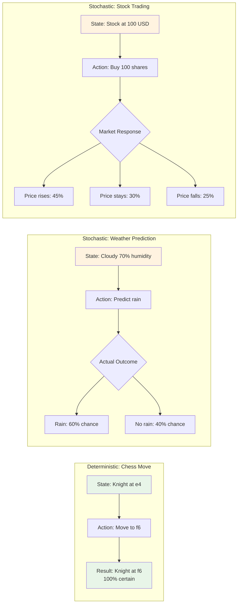

### 3. Episodic vs. Sequential

The **temporal structure** and how current actions affect future states.

#### Episodic Environments
- Current actions **do not affect** future outcomes
- Each episode is independent
- No carryover between episodes
- **Examples**: Email spam classification, Image recognition, Isolated diagnostics

#### Sequential Environments
- Current decisions **affect** future outcomes  
- Actions have long-term consequences
- History matters for optimal performance
- **Examples**: Chess, Autonomous driving, Investment planning

**How Sequential Environments Work:**
1. **Long-term Planning**: Actions must consider future implications
2. **Learning & Adaptation**: Past experiences inform future decisions
3. **Dependency on Past Actions**: Current state depends on action history

### 4. Static vs. Dynamic

The **temporal stability** of the environment during decision-making.

#### Static Environments
- Remain **unchanged** during AI system's decision process
- Environment waits for AI decisions
- No time pressure for decision making
- **Examples**: Crossword puzzles, Offline optimization, Batch processing

#### Dynamic Environments
- **Change independently** of the AI system's actions
- Environment evolves while AI is processing
- Real-time constraints on decision making
- **Examples**: Autonomous vehicles, Real-time games, Live trading systems

```mermaid
graph TB
    subgraph "Static: Sudoku Puzzle"
        A1[Puzzle State] --> B1[AI Processing Time<br/>Unlimited]
        B1 --> C1[Make Move]
        C1 --> D1[Puzzle waits<br/>unchanged during<br/>deliberation]
        D1 --> B1
    end
    
    subgraph "Dynamic: Air Traffic Control"
        A2[Aircraft Positions] --> B2[Planes keep moving<br/>Weather changing<br/>New flights arriving]
        B2 --> C2[Must decide quickly<br/>Real-time constraints]
        C2 --> D2[Environment continues<br/>evolving regardless]
        D2 --> B2
    end
    
    subgraph "Semi-Dynamic: Online Chess"
        A3[Board State] --> B3[Clock ticking but<br/>opponent waits]
        B3 --> C3[Time pressure but<br/>controlled changes]
        C3 --> D3[Board changes only<br/>after moves]
    end
    
    style D1 fill:#e8f5e8
    style B2 fill:#fff3e0
    style D2 fill:#fff3e0
    style C3 fill:#f3e5f5
```

### 5. Discrete vs. Continuous

The **nature of state and action spaces** in the environment.

#### Discrete Environments
- Have a **limited set** of possible states and actions
- Countable, finite choices
- Clear boundaries between states
- **Examples**: Board games, Text classification, Finite state machines

#### Continuous Environments
- Have **infinite** possible states and actions
- Real-valued parameters and smooth transitions
- Require approximation methods
- **Examples**: Robotics, Control systems, Physical simulations

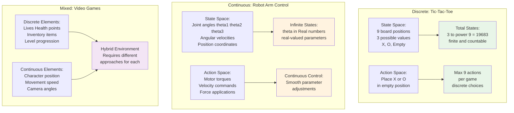

## Environment Classification

### Environment Complexity Spectrum

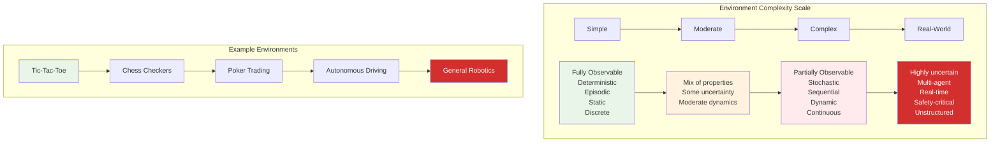

### Environment Categories by Domain

#### Game Environments
- **Board Games**: Chess, Go, Checkers
- **Card Games**: Poker, Blackjack, Bridge  
- **Video Games**: StarCraft, Dota, Minecraft
- **Puzzle Games**: Sudoku, Crosswords, Rubik's Cube

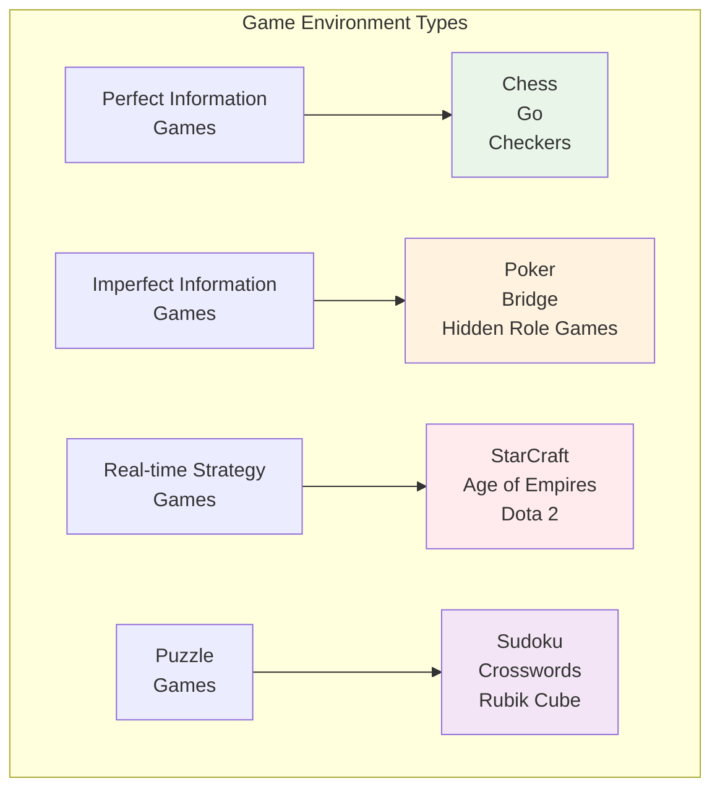

#### Physical Environments
- **Robotics**: Manufacturing, Service robots, Exploration
- **Autonomous Vehicles**: Cars, Drones, Ships
- **Control Systems**: Industrial processes, Power grids
- **IoT Systems**: Smart homes, Sensor networks

#### Virtual Environments
- **Simulations**: Physics engines, Economic models
- **Software Systems**: Operating systems, Networks
- **Digital Assistants**: Chatbots, Recommendation systems
- **Cybersecurity**: Intrusion detection, Threat analysis

#### Biological/Medical Environments
- **Drug Discovery**: Molecular interactions, Protein folding
- **Medical Diagnosis**: Symptom analysis, Image interpretation
- **Genetic Analysis**: DNA sequencing, Gene expression
- **Epidemiology**: Disease spread, Public health

## Real-World Examples

### Example 1: Vacuum Cleaner Robot Environment

A comprehensive analysis of a household cleaning robot's environment:

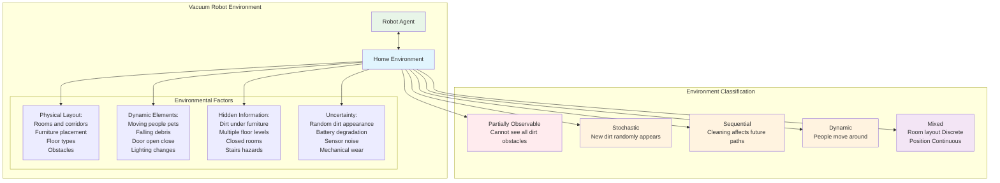

**Environment Challenges:**
- **Mapping**: Building accurate floor plans
- **Localization**: Knowing current position
- **Path Planning**: Efficient cleaning routes
- **Obstacle Avoidance**: Navigating around furniture
- **Battery Management**: Returning to dock when needed

### Example 2: Stock Trading Environment

Financial market environment for algorithmic trading:

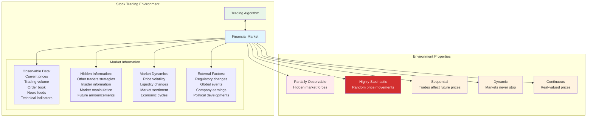

### Example 3: Medical Diagnosis Environment

Healthcare AI system environment:

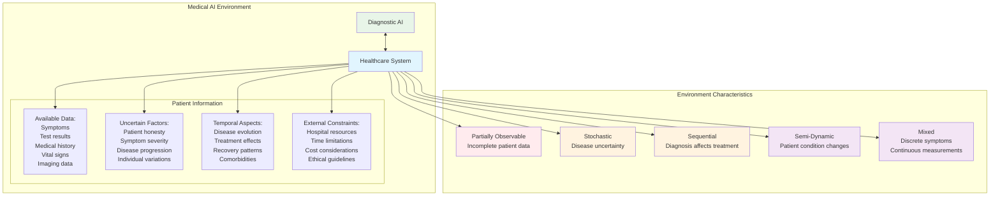

## Environment Design Considerations

### 1. Environment Modeling

When designing or analyzing environments, consider:

### 2. Environment Complexity Management

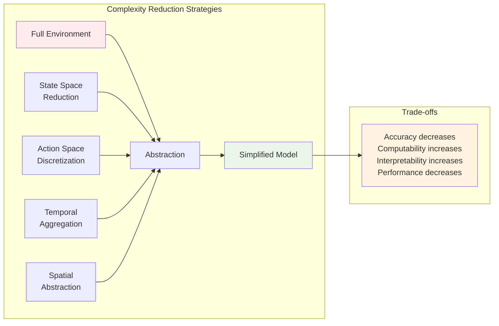

### 3. Environment Validation

Ensuring environment models are accurate and useful:

- **Realism**: Does the model capture essential aspects?
- **Scalability**: Can it handle larger problem instances?
- **Robustness**: Does it work under different conditions?
- **Measurability**: Can performance be quantified?
- **Reproducibility**: Are results consistent and repeatable?

## Simulation vs Real Environments

### Simulation Environments

**Advantages:**
- **Controlled conditions** for testing
- **Reproducible results** for comparison
- **Safe experimentation** without real-world risks
- **Cost-effective** development and testing
- **Faster iteration** cycles

**Disadvantages:**
- **Reality gap** - simulations may not capture all real-world complexity
- **Limited scope** - may miss important edge cases
- **Modeling errors** can lead to poor real-world performance
- **Computational constraints** limit simulation fidelity

### Real-World Environments

**Advantages:**
- **Complete realism** with all complexities
- **True performance** measurement
- **Authentic user feedback**
- **Real impact** and consequences

**Disadvantages:**
- **High costs** and risks
- **Difficult debugging** in complex scenarios
- **Limited control** over conditions
- **Slow iteration** due to practical constraints

## Environment Complexity Analysis

### Complexity Metrics

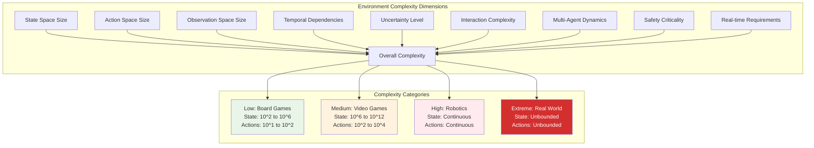

### Environment Difficulty Progression

Common progression from simple to complex environments:

1. **Toy Problems**: Grid worlds, simple puzzles
2. **Classic Games**: Chess, Checkers, Go
3. **Video Games**: Atari, StarCraft, Minecraft
4. **Simulated Physics**: MuJoCo, PyBullet, Unity
5. **Real-World Applications**: Robotics, Autonomous vehicles

## Best Practices

### Environment Design Principles

1. **Start Simple**: Begin with simplified versions before adding complexity
2. **Incremental Complexity**: Gradually increase difficulty as systems improve
3. **Clear Objectives**: Define success metrics and evaluation criteria
4. **Realistic Constraints**: Include relevant real-world limitations
5. **Balanced Challenge**: Not too easy or too hard

### Environment Documentation

### Environment Evaluation

- **Correctness**: Does it behave as specified?
- **Performance**: How efficiently does it run?
- **Realism**: How well does it represent the real world?
- **Usability**: How easy is it to use and understand?
- **Extensibility**: How easily can it be modified or extended?

## Common Challenges

### Technical Challenges

1. **State Representation**: Choosing appropriate state encodings
2. **Scalability**: Handling large state/action spaces
3. **Partial Observability**: Managing uncertainty and hidden information
4. **Temporal Dependencies**: Modeling sequential relationships
5. **Multi-Scale Dynamics**: Different time scales in the same environment

### Design Challenges

1. **Reality Gap**: Bridging simulation and real-world differences
2. **Complexity Balance**: Making environments challenging but solvable
3. **Evaluation Metrics**: Defining meaningful success measures
4. **Reproducibility**: Ensuring consistent results across runs
5. **Generalization**: Creating environments that test general capabilities

### Implementation Challenges

1. **Performance Optimization**: Efficient computation and memory usage
2. **Parallel Processing**: Supporting concurrent environment instances
3. **Integration**: Connecting with different AI frameworks
4. **Debugging**: Providing tools to understand environment behavior
5. **Version Control**: Managing environment changes over time

## Resources

### Environment Frameworks and Libraries

#### Reinforcement Learning Environments
- **OpenAI Gym**: Standard interface for RL environments
- **PyBullet**: Physics-based robotics simulation
- **Unity ML-Agents**: Game engine integration
- **MuJoCo**: Advanced physics simulation
- **AirSim**: Autonomous vehicle simulation

#### Game Environments  
- **OpenSpiel**: Multi-agent game research
- **PettingZoo**: Multi-agent environment library
- **Arcade Learning Environment**: Atari game interface
- **StarCraft II Learning Environment**: Real-time strategy games

#### Robotics Environments
- **Gazebo**: Robot simulation platform
- **V-REP/CoppeliaSim**: Robot simulation suite
- **ROS**: Robot Operating System
- **Isaac Sim**: NVIDIA robotics simulation

### Learning Resources

#### Books
- "Artificial Intelligence: A Modern Approach" - Russell & Norvig
- "Reinforcement Learning: An Introduction" - Sutton & Barto  
- "Multi-Agent Systems" - Gerhard Weiss

#### Research Papers
- Environment design methodologies
- Simulation-to-real transfer learning
- Multi-agent environment studies
- Benchmarking and evaluation frameworks

#### Online Courses
- CS 285 UC Berkeley: Deep Reinforcement Learning
- CS 231n Stanford: Convolutional Neural Networks
- CS 224n Stanford: Natural Language Processing

### Community and Tools

- **GitHub**: Open source environment repositories
- **Papers With Code**: Implementation benchmarks
- **OpenAI**: Research publications and tools
- **DeepMind**: Environment challenges and datasets

## Getting Started

### Environment Selection Guide

1. **Define Your Problem**: What are you trying to solve?
2. **Assess Complexity**: What level of complexity do you need?
3. **Choose Properties**: Which environment characteristics are important?
4. **Select Framework**: What tools and libraries will you use?
5. **Start Simple**: Begin with a basic version and iterate
6. **Validate Design**: Test your environment thoroughly
7. **Document Everything**: Make it easy for others to use

### Quick Start Checklist

- [ ] Define state and action spaces
- [ ] Specify dynamics and transition rules
- [ ] Design observation and feedback mechanisms
- [ ] Implement basic environment interface
- [ ] Create simple test scenarios
- [ ] Validate environment behavior
- [ ] Write documentation and examples
- [ ] Set up evaluation metrics
- [ ] Plan for future extensions

### Common Environment Examples

| Environment | Observable | Deterministic | Episodic | Static | Discrete | Complexity |
|-------------|------------|---------------|----------|--------|----------|------------|
| **Chess** | Fully | Yes | No | Yes | Yes | Medium |
| **Poker** | Partially | No | No | Yes | Yes | High |
| **Crossword** | Fully | Yes | No | Yes | Yes | Low |
| **Email Spam Detection** | Fully | No | Yes | Yes | Yes | Low |
| **Autonomous Driving** | Partially | No | No | No | No | Extreme |
| **Stock Trading** | Partially | No | No | No | No | High |
| **Video Games** | Partially | No | No | No | Mixed | Medium |
| **Web Search** | Partially | No | Yes | No | Yes | Medium |

---

*This README provides a comprehensive foundation for understanding AI environments. Use it as a reference guide when designing, implementing, or working with AI systems in various domains.*
